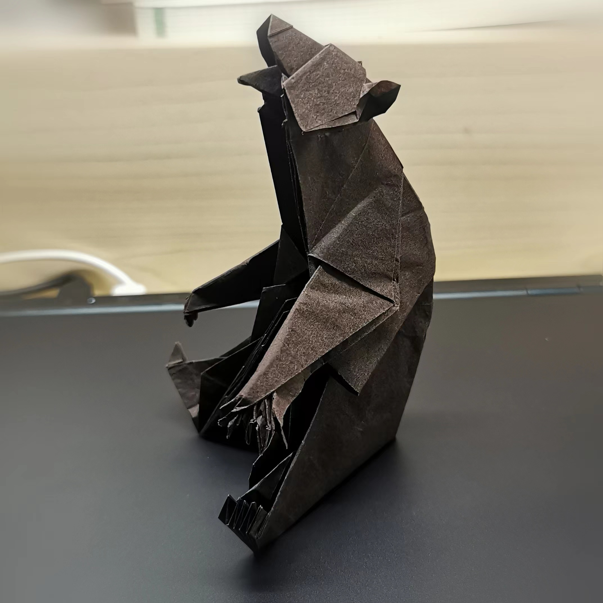
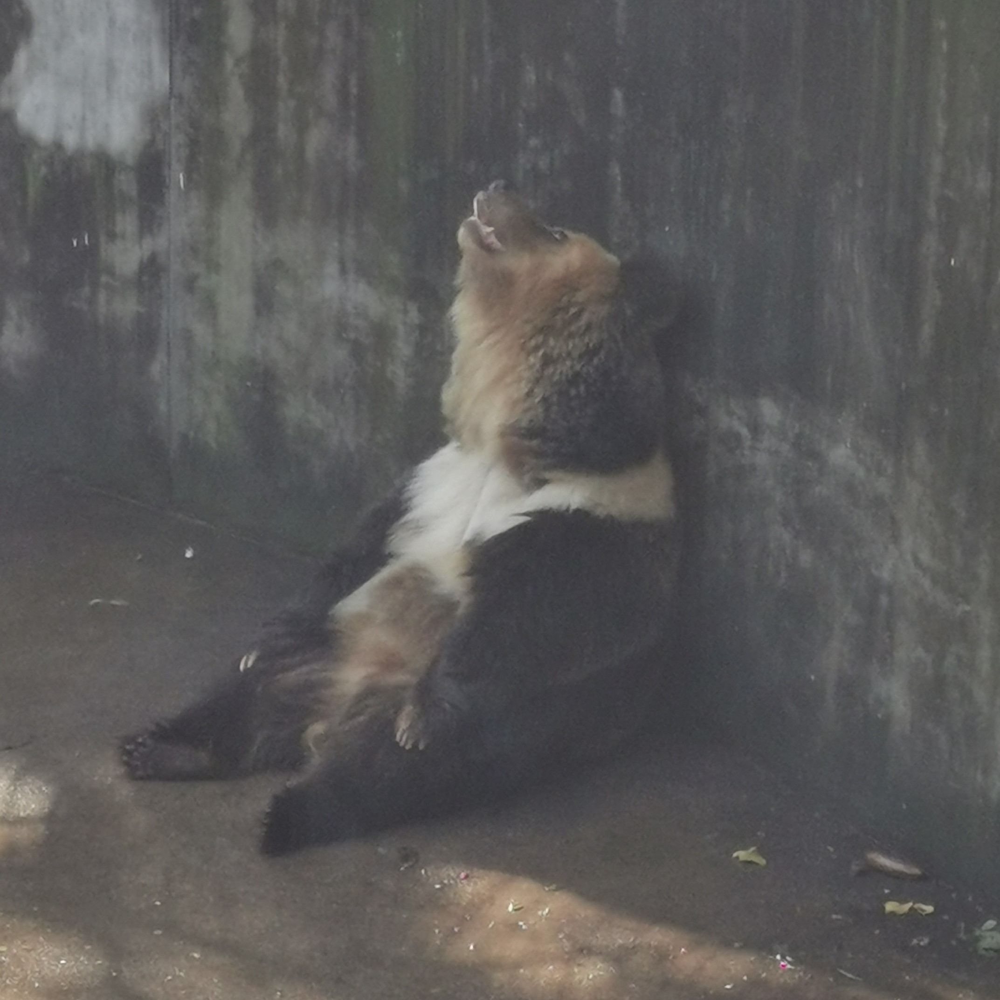
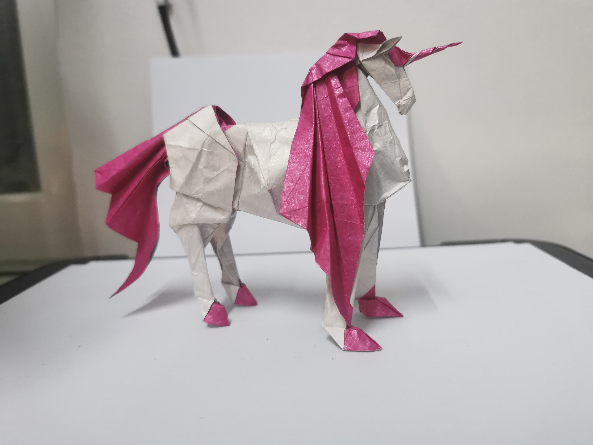
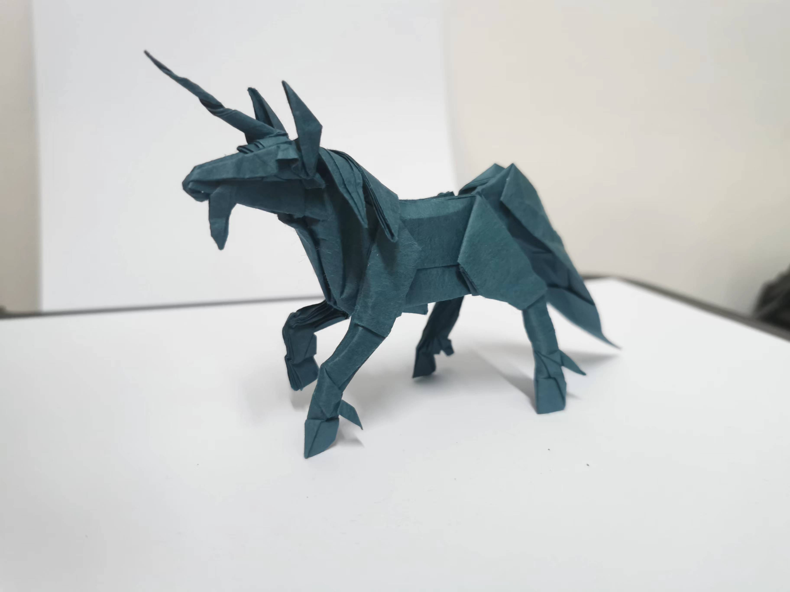
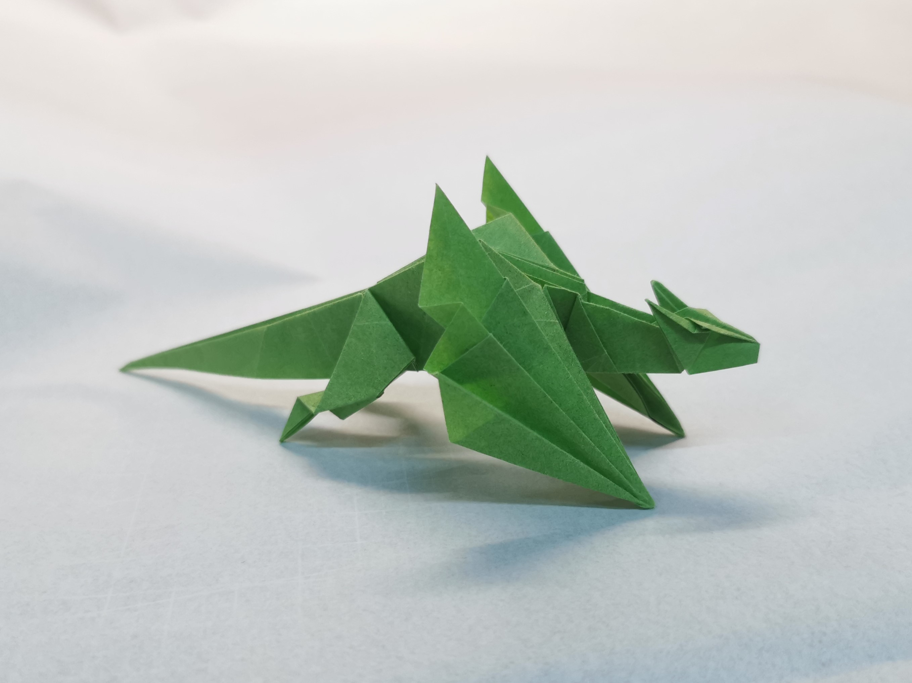

# Ziyuan's Origami Page

Welcome to my origami gallery! Here, I've showcased some of my favourite origami creations. I've established this webpage to share pieces I've previously posted on a Chinese forum, making them accessible to a global audience beyond China.

## A Lazy Bear, based on Quentin Trollip's Grizzly Bear

  
  

This origami bear was inspired by a photograph I took during a zoo visit. Quentin Trollip originally crafted the design, and I created this piece as a tribute to capture the likeness of the real bear, as seen on the right.

## Unicorn, designed by Kyohei Katsuta

  

Out of the unicorns I've folded, Kyohei Katsuta's design stands out as the most elegant. While I was still perfecting my skills with tissue-foil paper, the chest area didn't turn out as I'd hoped. But the result is still a sight to behold.

## Unicorn, designed by Kamiya Satoshi

  

Kamiya Satoshi's unicorn design is a challenging one to execute well. After three attempts, I achieved the look you see here. I'd initially planned to craft one using tissue foil paper, but time constraints got in the way.

## Unicorn, designed by Oriol Esteve

  

Oriol Esteve's unicorn is as adorable as it is simple to fold. It's an excellent project for those looking to practice their skills with tissue-foil paper, yielding a cute result every time.

## Wyvern, designed by Saku

  

I love this wyvern because of its simplicity. I once tried my hand at designing a wyvern, but that involved the use of scissors and glue—this rendition is a testament to the beauty of pure origami artistry.

## ἱππόκαμπος, designed by Roman Diaz

  

Inspired by the Iliad, where the ἱππόκαμπος is described as pulling Poseidon's chariot, this piece is as mythical as it is intricate. Crafted with "elephant hide" paper, it required significant physical effort to achieve the result.
